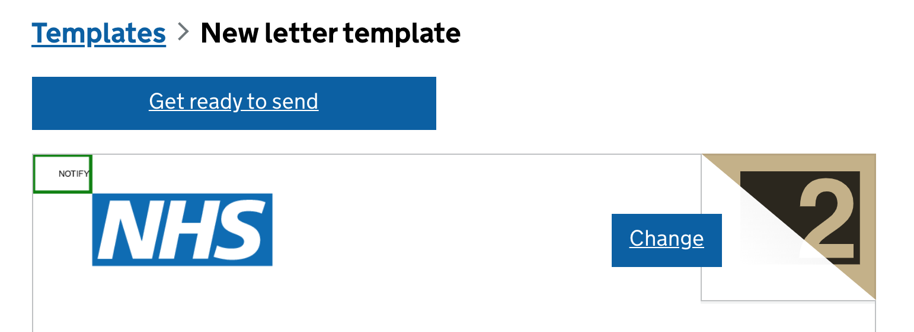

# NOTIFY tag

[See this PR for an example](https://github.com/alphagov/notifications-template-preview/pull/605). The actual font colour is white (invisible).

## Background

The tag is required by DVLA to identify the first page of each letter when they're combined in a single print run. From [the DVLA letter spec](https://drive.google.com/file/d/1vR4-02TlzA-VzXPhSrTr3MtUP5wog4x4/view) and email conversations:

- Suggested top-left corner position: (1.8, 1.8)
- Bounding box: top-left=(0, 0), bottom-right=(15.191, 6.149)
- Font: Arial, 6pt, black (but they're OK with white)

_All coordinates are expressed as (mm from left, mm from top)._

DVLA currently treat our PDFs as a special case: the bounding box where they look for the tag is much bigger than their spec implies. Ideally, we should keep the tag outside the yellow "customer" areas of the spec, but [historically we've not done this](https://github.com/alphagov/notifications-template-preview/pull/605) - it's unclear why. In practice, for our PDFs it's OK if the tag is in the periphery of the "customer" area, as [our actual letter spec](https://www.notifications.service.gov.uk/using-notify/guidance/letter-specification) is intentionally more strict.

## How we add it

### Precompiled letters

[We inject the tag automatically](https://github.com/alphagov/notifications-template-preview/blob/ad53b0b72880093ca0d8e649cde3d17fc19aed2c/app/precompiled.py#L326).

Originally, we asked services to do this for us and [at least one of them still does](https://github.com/alphagov/notifications-template-preview/pull/606#issuecomment-996646222), so we should [avoid injecting the tag twice](https://github.com/alphagov/notifications-template-preview/blob/ad53b0b72880093ca0d8e649cde3d17fc19aed2c/app/precompiled.py#L237) - it's unclear what the consequences of overlapping / duplicate text would be.

### Templated letters

[The tag is injected into the HTML template](https://github.com/alphagov/notifications-utils/blob/a046e9ab3863c1231aa6b559980926cf4122aae6/notifications_utils/jinja_templates/letter_pdf/_print_only_css.jinja2#L11) using [a margin box](https://www.w3.org/TR/css-page-3/#margin-boxes). The position of the tag is determined by [the CSS page margins](https://github.com/alphagov/notifications-utils/blob/a046e9ab3863c1231aa6b559980926cf4122aae6/notifications_utils/jinja_templates/letter_pdf/_main_css.jinja2#L5-L8) and can therefore differ from precompiled letters.

